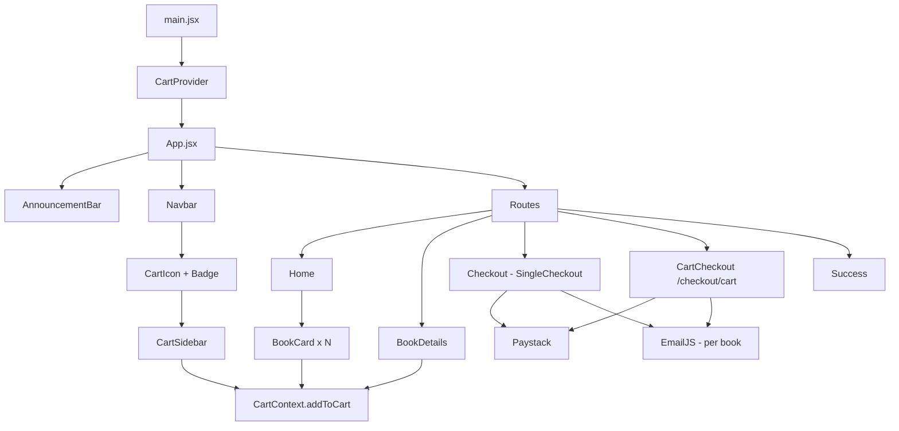
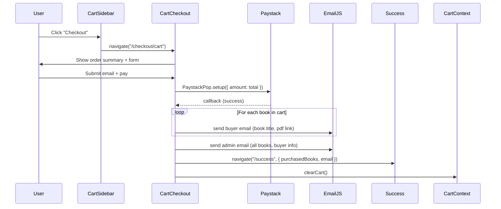

# Design Document: Book Store Enhancement

## Overview

This design covers the full enhancement of the Consulate Books React + Vite + Tailwind CSS application. The changes introduce a global cart system via React Context, a new design system, an announcement bar, redesigned pages, and a multi-book checkout flow — all while preserving the existing single-book checkout, Paystack, and EmailJS integrations.

The implementation is purely client-side. No backend changes are required. State is managed in-memory via React Context (no localStorage persistence required for cart).

---

## Architecture



The `CartProvider` wraps the entire app at the root level. All components that need cart access consume `CartContext` via the `useCart` hook.

---

## Components and Interfaces

### New Files

| File | Purpose |
|---|---|
| `src/context/CartContext.jsx` | Cart state, actions, and provider |
| `src/components/AnnouncementBar.jsx` | Dismissible sticky top bar |
| `src/components/CartSidebar.jsx` | Slide-in cart panel |
| `src/components/ToastNotification.jsx` | Auto-dismissing toast |
| `src/pages/CartCheckout.jsx` | Multi-book checkout page |

### Modified Files

| File | Changes |
|---|---|
| `tailwind.config.js` | New color tokens, fonts, shadows, animations |
| `index.html` | Google Fonts link tags (Poppins + Inter) |
| `src/App.jsx` | Wrap with CartProvider, add `/checkout/cart` route, render AnnouncementBar |
| `src/components/Navbar.jsx` | Add cart icon, badge, CartSidebar toggle |
| `src/components/BookCard.jsx` | Grid card layout, Add to Cart button, animations |
| `src/components/BuyButtons.jsx` | Add to Cart button, updated styling |
| `src/pages/Home.jsx` | Responsive grid layout, updated sections |
| `src/pages/BookDetails.jsx` | Two-column layout, animations, Add to Cart |
| `src/pages/Success.jsx` | Support multi-book purchased items display |

---

### CartContext Interface

```jsx
// src/context/CartContext.jsx
const CartContext = createContext();

// Shape of a cart item:
// { id, title, cover, prices, quantity }

// Exposed via useCart():
{
  cartItems: CartItem[],
  cartCount: number,           // sum of all quantities
  cartTotal: number,           // sum of (discounted ebook price * quantity)
  addToCart: (book) => void,
  removeFromCart: (bookId) => void,
  updateQuantity: (bookId, delta) => void,  // delta: +1 or -1
  clearCart: () => void,
}
```

### AnnouncementBar Interface

```jsx
// Props: none
// Internal state: dismissed (boolean), stored in sessionStorage
// Renders: null when dismissed
```

### CartSidebar Interface

```jsx
// Props: isOpen (bool), onClose (() => void)
// Consumes: useCart()
// Renders: overlay + slide panel with item list, subtotal, checkout button
```

### ToastNotification Interface

```jsx
// Managed globally via a ToastContext or simple state in App.jsx
// Props: message (string), visible (bool)
// Auto-dismisses after 3000ms
// Position: bottom-right or top-right, fixed
```

### BookCard Interface

```jsx
// Props: book (Book object)
// Consumes: useCart(), toast trigger
// Renders: cover, title, short description (2-line clamp), price badge, View + Add to Cart buttons
```

---

## Data Models

### Book (existing, from `src/data/books.js`)

```ts
interface Book {
  id: string;
  title: string;
  author: string;
  prices: {
    ebook?: { original: number; discounted: number };
    hardcopy?: { original: number; discounted: number };
  };
  hardcopyAvailable: boolean;
  amazonLink: string | null;
  pdf?: string;
  currency: string;
  shortDescription: string;
  description: string;
  cover: string; // imported image asset
}
```

### CartItem

```ts
interface CartItem {
  id: string;          // book.id
  title: string;
  cover: string;
  ebookPrice: number;  // book.prices.ebook.discounted
  quantity: number;
}
```

### CartState

```ts
interface CartState {
  cartItems: CartItem[];
  cartCount: number;
  cartTotal: number;
}
```

### Success Page Navigation State

```ts
// Single book (existing)
interface SingleSuccessState {
  bookId: string;
  purchaseType: "ebook" | "hardcopy";
  email: string;
  fullname: string;
}

// Multi-book cart (new)
interface CartSuccessState {
  purchasedBooks: CartItem[];
  email: string;
  fullname?: string;
}
```

---

## Tailwind Configuration

```js
// tailwind.config.js (relevant additions)
module.exports = {
  theme: {
    extend: {
      colors: {
        primary: "#1F3A5F",
        azure: "#007FFF",
        accent: "#F59E0B",
        bg: "#F8FAFC",
        card: "#FFFFFF",
        heading: "#0F172A",
        body: "#F5F7FA",
        // legacy aliases kept for backward compat:
        primaryHover: "#2563EB",
        footerBg: "#0F172A",
        footerText: "#E0F2FE",
      },
      fontFamily: {
        poppins: ["Poppins", "sans-serif"],
        inter: ["Inter", "sans-serif"],
      },
      boxShadow: {
        soft: "0 4px 24px rgba(0,0,0,0.08)",
        card: "0 2px 12px rgba(0,0,0,0.06)",
      },
      keyframes: {
        fadeInUp:    { "0%": { opacity: 0, transform: "translateY(24px)" }, "100%": { opacity: 1, transform: "translateY(0)" } },
        fadeInDown:  { "0%": { opacity: 0, transform: "translateY(-24px)" }, "100%": { opacity: 1, transform: "translateY(0)" } },
        fadeInLeft:  { "0%": { opacity: 0, transform: "translateX(-24px)" }, "100%": { opacity: 1, transform: "translateX(0)" } },
        fadeInRight: { "0%": { opacity: 0, transform: "translateX(24px)" }, "100%": { opacity: 1, transform: "translateX(0)" } },
        fadeIn:      { "0%": { opacity: 0 }, "100%": { opacity: 1 } },
        float:       { "0%, 100%": { transform: "translateY(0)" }, "50%": { transform: "translateY(-10px)" } },
        badgePop:    { "0%": { transform: "scale(1)" }, "50%": { transform: "scale(1.4)" }, "100%": { transform: "scale(1)" } },
      },
      animation: {
        fadeInUp:    "fadeInUp 0.5s ease-out both",
        fadeInDown:  "fadeInDown 0.5s ease-out both",
        fadeInLeft:  "fadeInLeft 0.5s ease-out both",
        fadeInRight: "fadeInRight 0.5s ease-out both",
        fadeIn:      "fadeIn 0.4s ease-out both",
        float:       "float 3s ease-in-out infinite",
        badgePop:    "badgePop 0.3s ease-out",
      },
    },
  },
};
```

---

## Cart Checkout Flow



---

## Error Handling

- IF a user navigates to `/checkout/cart` with an empty cart, THEN redirect to `/`.
- IF a book is not found in `books.js` during SingleCheckout, THEN render a "Book not found" message (existing behavior preserved).
- IF Paystack payment is cancelled, THEN show an alert "Payment cancelled" (existing behavior preserved).
- IF EmailJS send fails, THEN log the error silently — do not block the success redirect (existing behavior preserved).
- IF `book.prices.ebook` is undefined, THEN the "Add to Cart" button SHALL NOT be rendered.

---

## Testing Strategy

### Unit Tests

Unit tests should cover specific examples and edge cases:
- `CartContext`: adding a new item, adding a duplicate item (quantity increment), removing an item, updating quantity to 0 (auto-remove), clearing the cart.
- `AnnouncementBar`: renders when not dismissed, does not render after dismiss click.
- `CartSidebar`: renders empty state when cart is empty, renders items when cart has items, subtotal calculation.
- `BookCard`: renders "Add to Cart" when ebook price exists, does not render "Add to Cart" when no ebook price.
- `Success`: renders single book when `bookId` is in state, renders multiple books when `purchasedBooks` is in state.

### Property-Based Tests

Property-based tests use a library such as [fast-check](https://github.com/dubzzz/fast-check) to validate universal properties across many generated inputs. Each property test should run a minimum of 100 iterations.

Tag format for each test: `Feature: book-store-enhancement, Property N: <property text>`


---

## Correctness Properties

*A property is a characteristic or behavior that should hold true across all valid executions of a system — essentially, a formal statement about what the system should do. Properties serve as the bridge between human-readable specifications and machine-verifiable correctness guarantees.*

---

Property 1: addToCart increments quantity for existing items

*For any* cart state containing a book and any call to `addToCart` with that same book, the resulting cart should contain exactly one entry for that book with a quantity equal to the previous quantity plus 1, and the total number of distinct items in the cart should remain unchanged.

**Validates: Requirements 2.2**

---

Property 2: addToCart adds new book with quantity 1

*For any* cart state that does not contain a given book, calling `addToCart` with that book should result in the cart containing that book with quantity exactly 1, and the total number of distinct items should increase by 1.

**Validates: Requirements 2.3**

---

Property 3: updateQuantity removes item when quantity would drop below 1

*For any* cart item with quantity 1, calling `updateQuantity(bookId, -1)` should result in that item being absent from `cartItems`.

**Validates: Requirements 2.4**

---

Property 4: clearCart always produces an empty cart

*For any* cart state (empty or non-empty), calling `clearCart()` should always result in `cartItems` being an empty array and `cartCount` being 0.

**Validates: Requirements 2.6**

---

Property 5: Cart total equals sum of price times quantity for all items

*For any* collection of cart items, the computed `cartTotal` should equal the exact arithmetic sum of `(item.ebookPrice * item.quantity)` for every item in `cartItems`. This applies both to the CartSidebar subtotal display and the CartCheckout total.

**Validates: Requirements 5.5, 10.4**

---

Property 6: Add to Cart button visibility matches ebook price existence

*For any* book object, the "Add to Cart" button should be rendered if and only if `book.prices.ebook` is defined and non-null. Books without an ebook price must never show the button.

**Validates: Requirements 6.1, 6.4**

---

Property 7: Success page renders a download link for each ebook in purchasedBooks

*For any* array of purchased cart items passed to the Success page via navigation state, the rendered output should contain exactly one download link per item that has a `pdf` field defined.

**Validates: Requirements 12.1, 12.2**

---

Property 8: Badge count reflects cartCount and is hidden when zero

*For any* cart state, the badge rendered in the Navbar should display a number equal to `cartCount`. When `cartCount` is 0, the badge element should not be visible (hidden or not rendered).

**Validates: Requirements 4.2, 4.3**
